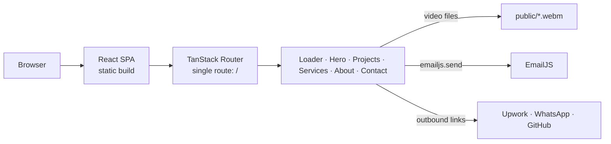

# AI Engineer Portfolio

Single-page portfolio for Ammar Maamoun, an AI engineer: a video-led landing page that presents AI project demos, priced service packages, and ways for prospective clients to get in touch.

[Live Site](https://ammarmaamoun.vercel.app)

## Overview

The site is built to convert freelance leads. A visitor lands on a full-screen video hero with a typewriter headline, then scrolls through demo videos of five AI projects, a three-tier package section, an about section, and a contact section that offers Upwork, WhatsApp and an email form.

It is a static front end with no backend of its own. Its only outbound request is the contact form, which sends through EmailJS directly from the browser.

## Key Features

- **Video hero**: full-screen looping background video. The headline is typed out by a custom `Typewriter` component after the video starts playing, cycling through six phrases and stopping on the last one.
- **Animated loader**: an "AI" splash overlay that fades out after 3.4 seconds.
- **Project showcase**: five AI projects (website data harvester, LSTM stock prediction, emotion detection, automated trading bot, bank-client conversion predictor). Each has a demo video, a pitch, and a link to its source on the engineer's GitHub.
- **Service packages**: three hourly-rate tiers (Basic, Standard, Premium) shown as cards that flip in with a one-time 3D animation.
- **Scroll-spy navigation**: a fixed side navigation with icon buttons that highlights the section in view and smooth-scrolls to a section on click.
- **Contact section**: Upwork and WhatsApp links, plus a collapsible email form with client-side validation and success/error feedback.

## Tech Stack

| Area | Tools |
| --- | --- |
| UI | React 19, TypeScript (strict mode) |
| Routing | TanStack Router with file-based routes and automatic code splitting |
| Styling | Tailwind CSS 4 plus custom CSS for animations and fonts (`src/styles.css`) |
| Icons | lucide-react |
| Contact form | EmailJS (`@emailjs/browser`) |
| Build | Vite 7 |
| Testing | Vitest and Testing Library are installed; no tests exist |

## Architecture



`vite build` produces static files in `dist/`, so no server is required. The router has one route (`/`), defined in `src/routes/index.tsx`, which composes the sections in this order: `Loader`, `Hero`, `Navbar`, `Projects`, `Services`, `About`, `Upwork` (the contact section). `src/routes/__root.tsx` wraps every route in `HomeLayout` (black background, white text) and mounts the TanStack devtools.

## Project Structure

```text
.
├── index.html               Page title, meta description, favicon
├── public/                  Demo videos (.webm), portrait, logos, manifest, robots.txt
├── src/
│   ├── main.tsx             Entry point, router creation
│   ├── routes/
│   │   ├── __root.tsx       Root layout and router devtools
│   │   └── index.tsx        The single page, composes the sections
│   ├── layouts/HomeLayout.tsx
│   ├── components/
│   │   ├── Hero.tsx         Background video, typewriter headline
│   │   ├── Typewriter.tsx   Typing/deleting text effect
│   │   ├── Loader.tsx       Splash overlay
│   │   ├── Navbar.tsx       Fixed side navigation with scroll-spy
│   │   ├── Projects.tsx     Project data and video cards
│   │   ├── Services.tsx     Pricing cards
│   │   ├── About.tsx        Portrait and bio
│   │   └── Upwork.tsx       Contact section and EmailJS form
│   ├── routeTree.gen.ts     Generated by the TanStack Router plugin
│   └── styles.css           Fonts, loader and card animations
├── vite.config.ts
└── tsconfig.json
```

## Engineering Notes

### Video is loaded lazily and controlled by visibility

Each project card sets `preload="none"` and plays only when it is useful: an `IntersectionObserver` starts the video when 60% of it is visible and pauses and rewinds it when it scrolls away, and hovering also plays and pauses it. This keeps five videos from downloading or playing at once. The trade-off is that nothing appears until the poster or the first frame loads; the poster paths point at files that are not in the repository (see Known Limitations).

### The headline waits for the hero video

`Hero.tsx` renders the typewriter only after the video's `onPlay` event, and `Typewriter` adds a further 3-second start delay so the headline begins after the loader has gone. The effect is timed to the video. The trade-off is that if the browser blocks autoplay, `startTyping` is never set and the headline area stays empty.

### Content is defined in the components

The project list is an array in `Projects.tsx` and the pricing tiers are props in `Services.tsx`. There is no separate data layer or CMS, which keeps the site simple to edit but means content changes require a code change and a redeploy.

### Animations default to a visible state

The pricing-card 3D twirl is a CSS animation added once by an `IntersectionObserver` (at 50% visibility). The base CSS keeps cards fully visible, so content is not hidden if the animation class is never applied.

### Contact form runs entirely in the browser

`Upwork.tsx` validates the fields (well-formed email, optional phone of at least 7 digits, message of at least 10 characters) and calls `emailjs.send(...)` with the sender's details. With no server in between, the EmailJS identifiers used by the form are necessarily part of the shipped JavaScript. Delivery depends on the EmailJS service and template configured for it.

### Type checking runs after the bundle

`npm run build` runs `vite build` and then `tsc`. TypeScript is configured with `strict`, `noUnusedLocals` and `noUnusedParameters` and `noEmit`, so `tsc` acts as a type check gate on the build.

## Accessibility

Implemented in the code:

- `lang="en"` on the document and an `alt` on the portrait image
- Background and project videos are `muted` and `playsInline`, so they are not blocked by autoplay policies for muted media and do not play sound
- Native `required` and `type="email"` on the email and message inputs

Not implemented, and worth knowing:

- The side-navigation buttons are icon-only with no accessible names
- Form `<label>` elements are not associated with their inputs
- There is no `prefers-reduced-motion` handling for the loader, typewriter, card animation or videos
- The `<h1>` has no text until the typewriter starts

No automated accessibility testing is set up, and no conformance level is claimed.

## Performance

- TanStack Router's `autoCodeSplitting` is enabled. The production build emits two JavaScript chunks (about 271 kB and 23 kB, 86 kB and 9 kB gzipped) and one CSS file (about 23 kB).
- Videos use `preload="none"` and the compact `.webm` format. Commit history shows an earlier `.mp4` set was replaced by `.webm` files.
- Images are served as-is, without resizing or format conversion.
- No measured scores (for example Lighthouse) are recorded in the repository.

## Security

- The site has no backend, database or user accounts, so there is no server-side attack surface in this repository.
- The contact form's EmailJS service ID, template ID and public key are written directly in `src/components/Upwork.tsx` instead of being read from environment variables. Anyone can read them from the built JavaScript. Moving them to `VITE_` environment variables (as the ProjectManager site does) and rotating them in the EmailJS dashboard would make configuration changes easier, and restricting the allowed domains in EmailJS limits misuse.
- External links open with `target="_blank"` and no `rel="noopener"`; modern browsers apply `noopener` by default for `_blank`.

## Getting Started

### Prerequisites

- Node.js and npm. Verified with Node 24 and npm 11; no engine version is pinned.

### Install and run

```bash
git clone https://github.com/rehab-elkadim/AiEngineerPortfolio.git
cd AiEngineerPortfolio
npm install
npm run dev
```

The dev server runs at `http://localhost:3000`.

### Available scripts

| Command | Purpose |
| --- | --- |
| `npm run dev` | Start the Vite dev server on port 3000 |
| `npm run build` | Build with Vite, then type-check with `tsc` |
| `npm run preview` | Serve the production build locally |
| `npm run test` | Run Vitest (currently exits with an error: no test files exist) |

### Environment variables

None. The application does not read environment variables.

## Customizing Content

| To change | Edit |
| --- | --- |
| Project cards (title, pitch, video, GitHub link) | the `projects` array in `src/components/Projects.tsx` |
| Package names, prices and features | the `PricingCard` props in `src/components/Services.tsx` |
| Hero headline phrases | the `words` prop in `src/components/Hero.tsx` |
| Bio and portrait | `src/components/About.tsx`, `public/Ammar.jpg` |
| Upwork, WhatsApp links and EmailJS setup | `src/components/Upwork.tsx` |
| Page title and meta description | `index.html` |
| Demo videos | `public/*.webm` (referenced by path from `Projects.tsx` and `Hero.tsx`) |

## Testing and Quality

- `npm run build` succeeds, including the strict `tsc` type check.
- There are no automated tests, linter, formatter or CI. `npm run test` fails because Vitest finds no test files.

## Deployment

`npm run build` outputs a static site to `dist/`. The live site at https://ammarmaamoun.vercel.app is served from a static build. The repository contains no deployment configuration or CI workflow, so the hosting setup is not documented here beyond the live URL. Any static host that serves `dist/` will work.

## Known Limitations

- Custom fonts (`Urbancat` and `Future` families) are declared in `src/styles.css` from `src/assets/fonts/`, but that directory is not in the repository. A fresh clone falls back to system fonts, and `npm run build` prints font-resolution warnings.
- Video posters are referenced at `/posters/hero.jpg` and `/posters/<project title>.jpg`, but no `public/posters/` directory exists.
- The "Buy Now" button on each package card has no click handler, so it does not do anything.
- `emailjs` is listed in `package.json` but is not imported anywhere; only `@emailjs/browser` is used.
- `public/manifest.json` still contains the TanStack starter defaults ("Create TanStack App Sample").
- `public/` is about 35 MB, mostly demo videos.
- No license file is included.
